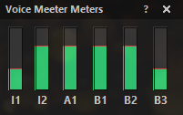
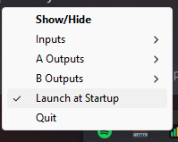

#  Voice Meeter Meters

A simple, small visual display for cleaner desktop space for Voice Meeter Potato. 

Basically, I want to see my levels without the massively huge Voice Meeter GUI while I'm streaming - just so I'm aware of any audio problems. This is a simple tiny system tray app that displays Inputs and Outputs and their volume levels. 

 

-----

## Download:

**Option 1: Grab the prebuilt .exe**

Download `VoiceMeeterMeters.exe` from the [latest release](https://github.com/Chenzo/voice-meeter-meters/releases/) and run it - no Python required.

**Option 2: Build it yourself**

Clone the repo and run the Install/Build commands below to produce your own `dist\VoiceMeeterMeters.exe`.

-----

## How it works

The app connects to a running copy of VoiceMeeter Potato through the `voicemeeter-api` library and polls the levels of the strips/buses you list in the `CHANNELS` config (in `vm_monitor.py`) at a fixed rate (`POLL_HZ`). Each channel gets its own small vertical or horizontal bar that fills up with its current dB level, colored green/yellow/red as it approaches clipping, with a slight release-decay so the bars don't flicker on quiet passages.

The window itself is a tiny, borderless, always-on-top Tkinter widget that you can drag anywhere with the left mouse button (its position is saved to `%APPDATA%\VoiceMeeterMeters\position.json` and restored next launch). It also lives in the system tray via `pystray`, where you can show/hide it, quit, or (once built as an .exe) toggle launching at Windows startup. Right-clicking the widget opens a small menu to toggle always-on-top.

-----

### Install:

```
python -m venv venv
venv\Scripts\activate
pip install voicemeeter-api pystray pillow pyinstaller
python vm_monitor.py
```


### Run:
```
venv\Scripts\activate
python vm_monitor.py
```

### Build:

```
venv\Scripts\activate
venv\Scripts\pyinstaller.exe --onefile --windowed --icon=icon.ico --add-data "icon.ico;." --name "VoiceMeeterMeters" vm_monitor.py
```


### Release:

```
git tag -a v1.0.0 -m "v1.0.0"
git push origin v1.0.0
gh release create v1.0.0 dist/VoiceMeeterMeters.exe --title "v1.0.0" --notes "Initial release"
```